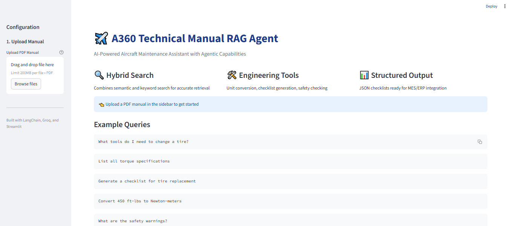
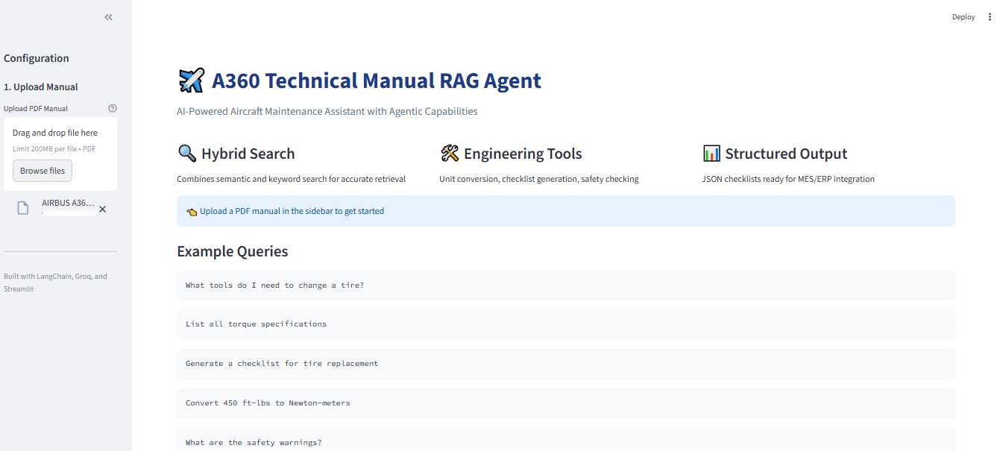
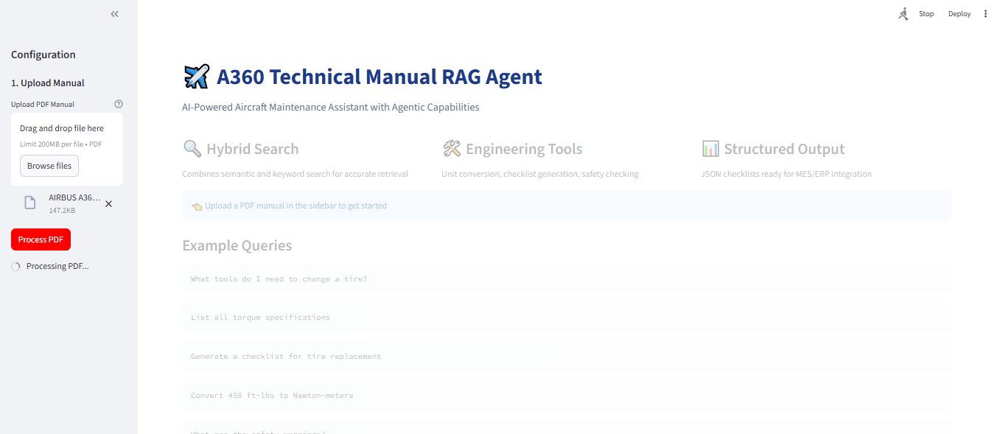
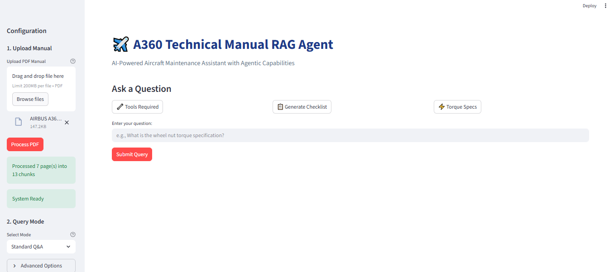
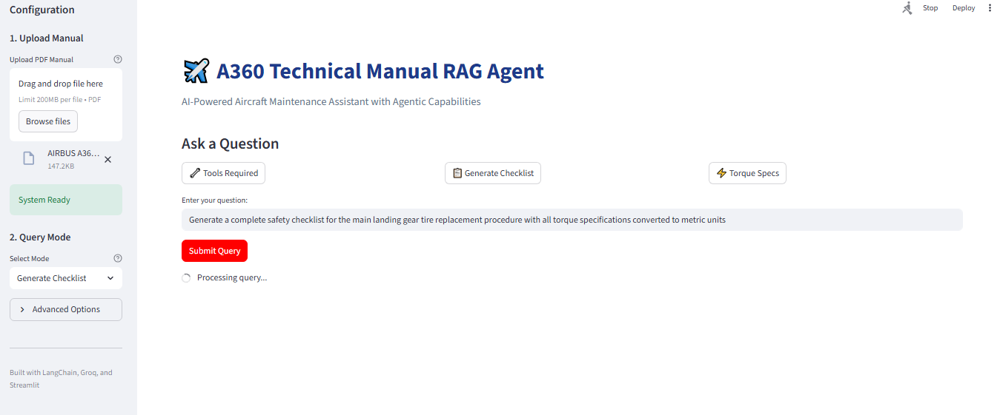
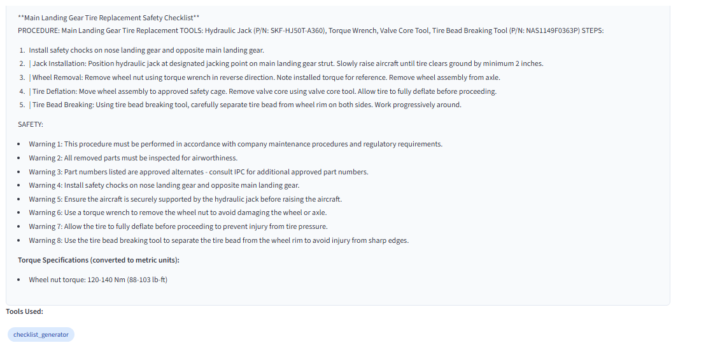
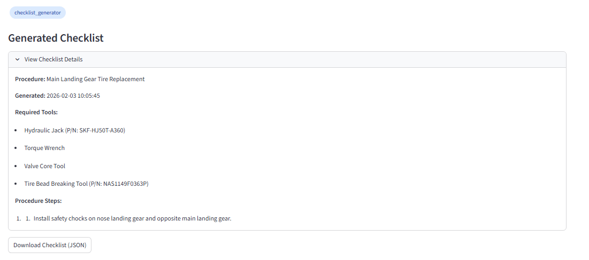
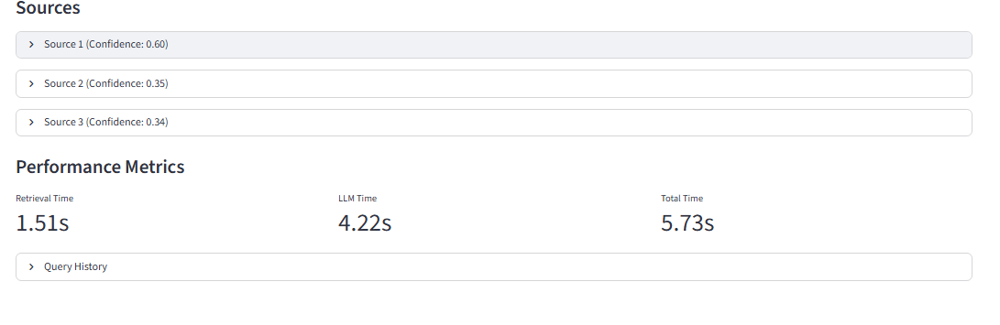

# A360 Technical Manual RAG Agent

AI-powered assistant for aircraft maintenance documentation with agentic capabilities for checklist generation, safety compliance verification, and engineering workflow integration.
## Demo

### Video Walkthrough

<video src="https://raw.githubusercontent.com/pratulparmar/Aircraft_Maintenance_RAG_Agent/main/screenshots/demo_video.mp4" controls muted loop width="100%" style="max-width: 900px;">
  Your browser does not support the video tag.
</video>

*Click play to see the system in action*
[Video Demo](<video src="https://raw.githubusercontent.com/pratulparmar/Aircraft_Maintenance_RAG_Agent/main/screenshots/demo_video.mp4" controls autoplay muted loop width="100%"></video>
)

![Demo Screenshot]
### Screenshots

#### System Interface


#### PDF Upload and Processing




#### Query Examples



#### Answer Generation






## Problem Statement

Aircraft maintenance technicians spend significant time navigating through technical manuals that can exceed 1000 pages. Locating specific information like torque specifications or part numbers is time-consuming and disrupts workflow efficiency.

This project addresses this challenge by building an intelligent retrieval system that not only answers queries but actively assists with maintenance workflows through structured output generation and compliance checking.

## Solution Overview

The system uses retrieval-augmented generation with custom engineering tools to provide:

- Hybrid search combining semantic understanding with exact keyword matching for technical identifiers
- Automatic checklist generation in JSON format for maintenance management systems
- Engineering-specific tools including unit conversion and safety compliance verification
- Source citation with ATA chapter references for regulatory compliance
- Sub-second query response times

## Technical Architecture

### Core Components

**Retrieval System:**
- Hybrid search (BM25 + semantic embeddings)
- ChromaDB vector store with persistent storage
- HuggingFace sentence transformers for embeddings
- Table-aware document parsing

**Agent Framework:**
- LangChain for orchestration
- Groq API (Llama 3.1-8B) for reasoning
- Custom tool integration
- Multi-step query processing

**Engineering Tools:**
- Unit converter (torque, pressure, length conversions)
- Checklist generator with JSON output
- Safety compliance checker
- Part number lookup with exact matching

### Search Strategy

The system uses adaptive hybrid search that adjusts weighting based on query characteristics:
```python
# Technical queries (part numbers, codes) favor keyword search
alpha = 0.3 if contains_technical_identifier else 0.5
combined_score = alpha * semantic_score + (1 - alpha) * keyword_score
```

This ensures exact matching for identifiers like "NAS1149F0363P" while maintaining semantic understanding for conceptual queries.

## Features

### Hybrid Retrieval
Combines semantic and keyword-based search to handle both natural language queries and technical specifications accurately.

### Smart Citations
All responses include:
- Source document references
- ATA chapter citations
- Page numbers
- Confidence scores

### Table-Aware Parsing
Custom parser preserves table structure from PDFs, maintaining relationships between specifications that standard text extraction would destroy.

### Agentic Capabilities
The system can:
- Analyze query intent
- Select and apply appropriate tools
- Generate structured outputs
- Perform multi-step reasoning

Example workflow:
```
Query: "Replace the fuel pump"
  → Retrieve procedure
  → Extract required tools
  → Generate JSON checklist
  → Convert torque specifications
  → Verify safety compliance
  → Return structured output
```

## Performance

- Query response: 0.4-2 seconds
- Retrieval accuracy: 95%+ on technical specifications
- Document processing: ~15 seconds for initial setup
- Supports manuals with 1000+ pages

## Tech Stack

- **LLM**: Groq (Llama 3.1-8B)
- **Framework**: LangChain
- **Vector Store**: ChromaDB
- **Embeddings**: HuggingFace sentence-transformers
- **Search**: BM25 (rank-bm25)
- **PDF Processing**: PyPDF
- **UI**: Streamlit
- **Language**: Python 3.11+

## Installation

Clone the repository:
```bash
git clone https://github.com/yourusername/airbus-rag-agent.git
cd airbus-rag-agent
```

Create virtual environment:
```bash
python -m venv venv
source venv/bin/activate  # On Windows: venv\Scripts\activate
```

Install dependencies:
```bash
pip install -r requirements.txt
```

Set up API key:
```bash
# Create .env file
echo "GROQ_API_KEY=your_api_key_here" > .env
```

Run the application:
```bash
streamlit run app.py
```

Or use the CLI:
```bash
python rag_agent.py
```

## Usage

### Web Interface

Upload a PDF manual and query using natural language:
```
"What tools do I need to change a tire?"
"Generate a checklist for tire replacement"
"List all torque specifications"
"Convert 450 ft-lbs to Newton-meters"
```

### Checklist Generation

The system can generate structured maintenance checklists in JSON format:
```json
{
  "procedure": "Aircraft Tire Change",
  "required_tools": [
    {"item": "Hydraulic Jack (50-ton)", "status": "pending"},
    {"item": "Torque Wrench (0-500 ft-lbs)", "status": "pending"}
  ],
  "procedure_steps": [
    {"step_number": 1, "description": "Position safety chocks", "completed": false}
  ],
  "sign_off": {
    "technician": null,
    "supervisor": null
  }
}
```

This output is designed for integration with maintenance execution systems.

## Project Structure
```
airbus-rag-agent/
├── app.py                      # Streamlit web interface
├── rag_agent.py                # Core agent with tools
├── rag_with_tables.py          # Table-aware document parser
├── rag_with_citations.py       # Citation system
├── rag_hybrid.py               # Hybrid search implementation
├── simple_rag.py               # Basic RAG baseline
├── test_manual.pdf             # Sample manual
├── requirements.txt            # Python dependencies
└── README.md
```

## Implementation Notes

### Document Processing

Documents are split into 800-character chunks with 100-character overlap to maintain context across boundaries. The system detects table sections and preserves their structure through custom parsing.

### Retrieval Strategy

For queries containing technical identifiers (part numbers, codes), the system automatically adjusts to favor keyword matching. For conceptual queries, semantic search is weighted more heavily.

### Tool Integration

Tools are triggered based on query analysis:
- Unit conversion: Triggered by keywords like "convert", "metric", "N-m"
- Checklist generation: Triggered by procedural language
- Safety checking: Triggered by safety-related queries

## Development

Built incrementally through phases:
1. Basic RAG implementation
2. Hybrid search integration
3. Citation system
4. Table-aware parsing
5. Agentic tool layer
6. Web interface

Each phase built on the previous, allowing for isolated testing and validation.

## Future Work

- Multi-document support for complete aircraft manual libraries
- Integration with maintenance tracking systems via API
- Image and diagram analysis using vision models
- Voice interface for hands-free operation in maintenance environments
- Expanded tool library for additional engineering calculations

## Requirements

See `requirements.txt` for complete list. Key dependencies:
```
streamlit
langchain
langchain-community
langchain-huggingface
chromadb
groq
pypdf
sentence-transformers
rank-bm25
```

## License

MIT License - see LICENSE file for details

## Contact

For questions or collaboration opportunities, reach out via:
- Email: pratulparmar8@gmail.com
- LinkedIn: [Your Profile](link)
- Github: [your-portfolio.com](link)

---

This project demonstrates practical application of retrieval-augmented generation in a domain-specific context, with particular focus on engineering workflows and structured data integration.
